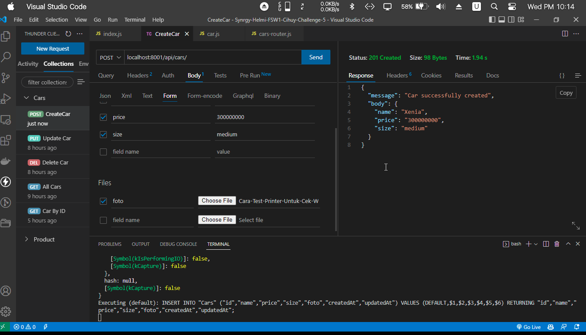
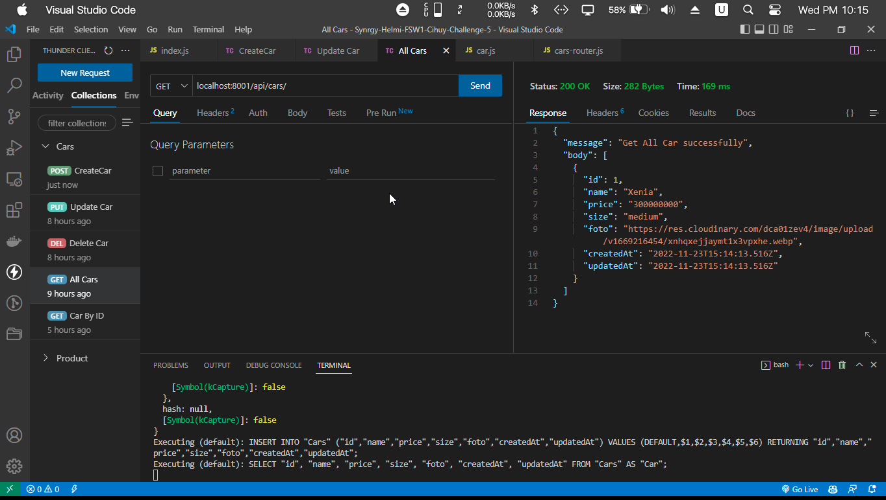
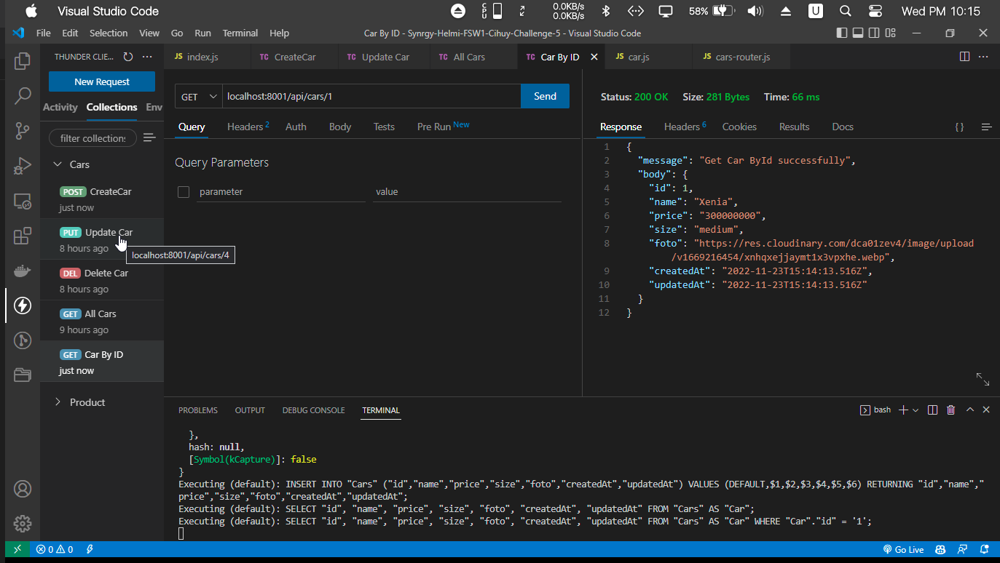
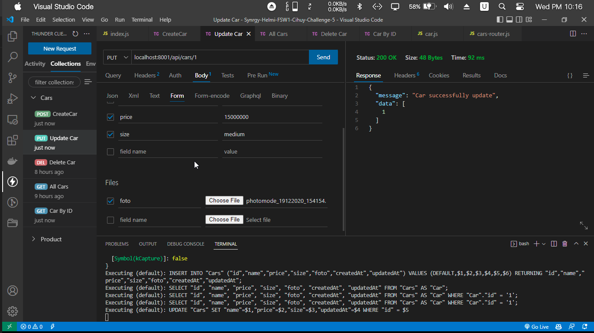
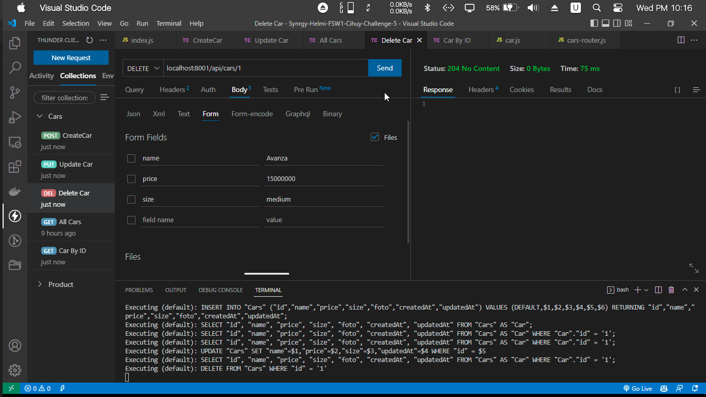

## Challenge 5 

```sh
## Database  
Postgresql 
nama database -> cars_development
isi tabel -> name: STRING,
    price: INTEGER,
    size: STRING,
    foto: STRING,
    created_at timestamp,
    updated_at timestamp
```

```sh
Link DatabaseDiagramIo -> https://dbdiagram.io/d/63703906c9abfc61117230b6
```

```sh
## Endpoint CRUD  
//POST
router.post('/api/cars');

//GET ALL
router.get('/api/cars');
//GET BY ID
router.get('/api/cars/:id');

//UPDATE
router.put('/api/cars/:id');

//DELETE
router.delete('/api/cars/:id');

```
## Bukti Screenshoot








## Usage

```sh
NPM install 
sequelize db:create
sequelize db:migrate
npx nodeman index.js
```


